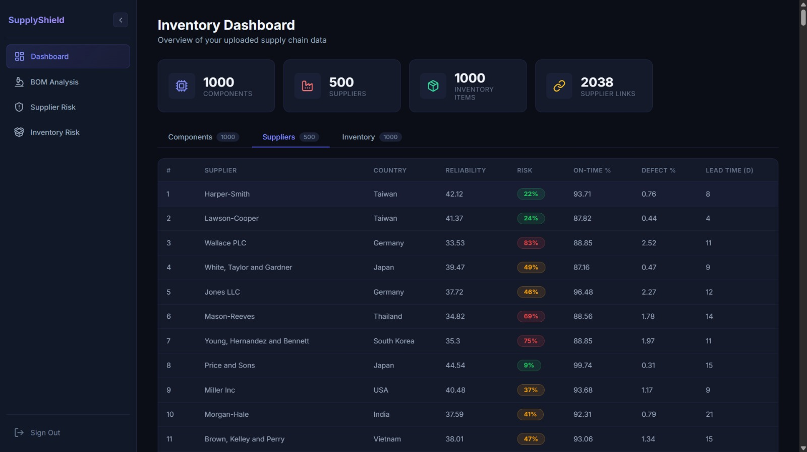
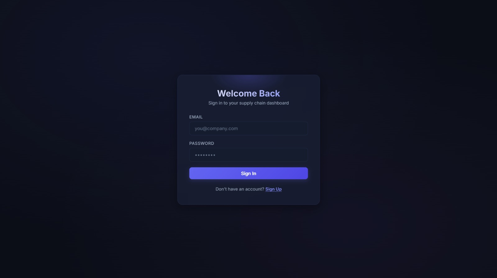
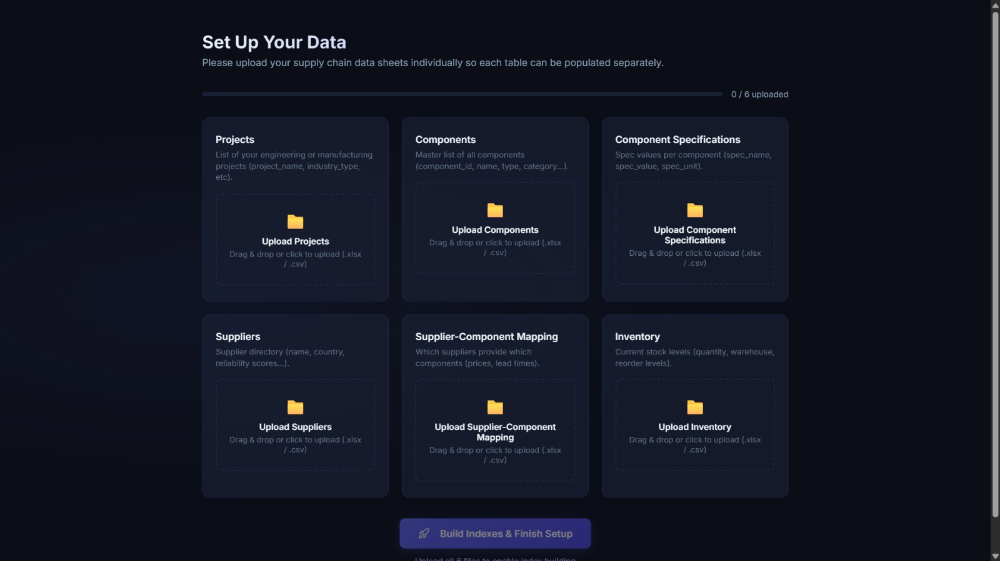
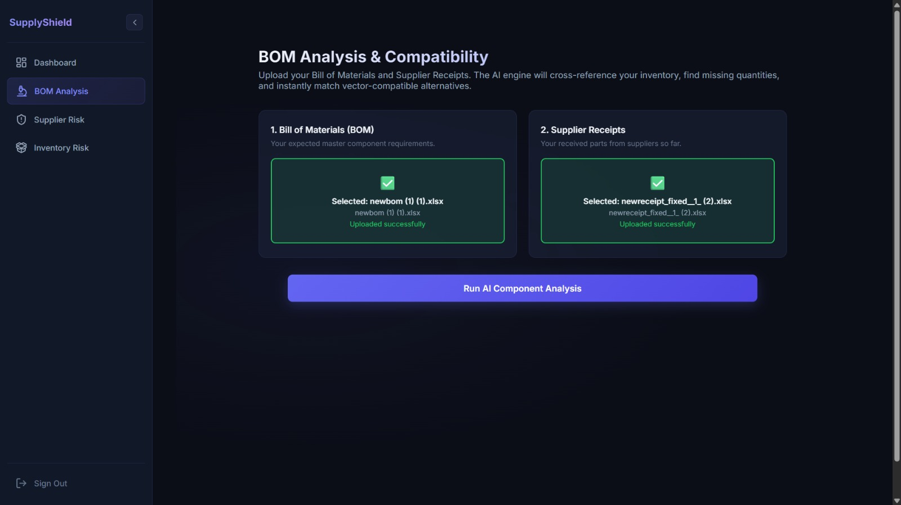
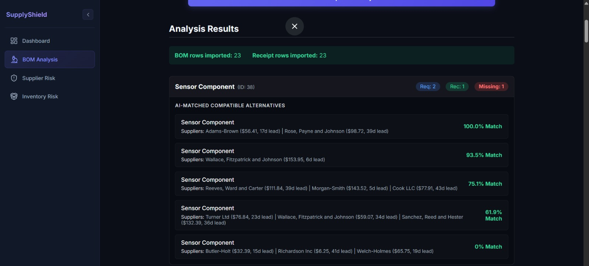
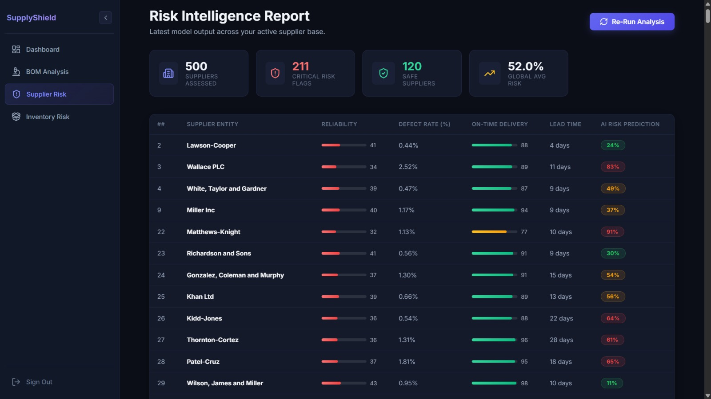
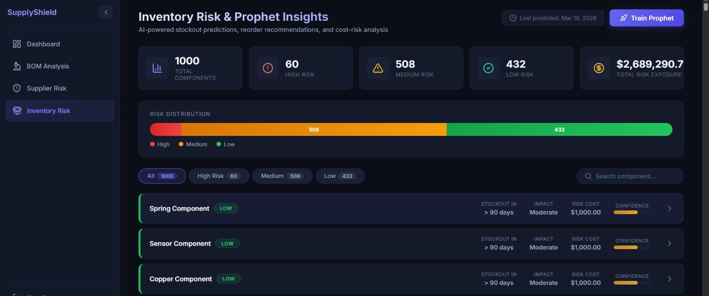

# 🛡️ SupplyShield

**AI-Powered Supply Chain Risk Intelligence & Inventory Orchestration.**

SupplyShield is a comprehensive platform designed to predict supplier risks, forecast inventory stockouts, and analyze Bills of Materials (BOM) using advanced machine learning models. It empowers supply chain managers to make proactive decisions through an intuitive, data-rich dashboard.

   

## 🌄 Demo









## 🚀 Key Features

* **⚠️ Supplier Risk Prediction:** Uses machine learning (deployed via Hugging Face) to cross-reference delivery history, defect rates, and reliability scores, instantly identifying high-risk suppliers.
* **📈 Prophet Inventory Forecasting:** Generates 90-day time-series forecasts using Facebook Prophet to accurately predict stockouts and recommend reorder dates.
* **📦 BOM Analysis & Vector Search:** Upload Bill of Materials (BOM) and supplier receipts to automatically detect missing components. Utilizes FAISS vector search to suggest compatible alternative parts on the fly.
* **📊 Interactive Dashboards:** Visualizes complex supply chain metrics using Recharts, giving a clear overview of total risk exposure, component counts, and supplier health.
* **🔐 Secure Authentication:** Fully integrated with Supabase for secure, token-based user authentication and data isolation.

---

## 🛠️ Tech Stack

### Frontend
* **ReactJS** + **Vite**: High-performance UI rendering and fast build times.
* **Recharts**: For rendering dynamic time-series forecasts and data distributions.
* **Lucide React**: For clean, professional, and responsive SVG iconography.
* **Supabase Client**: For secure user sessions and backend database interactions.

### Backend & ML Infrastructure
* **FastAPI**: Asynchronous, high-performance API gateway.
* **Scikit-Learn & Joblib**: For loading and executing the core heuristic risk prediction models.
* **Facebook Prophet**: For robust, seasonality-aware time-series inventory forecasting.
* **FAISS (Facebook AI Similarity Search)**: For rapid vector-based compatibility matching algorithms.
* **SQLAlchemy**: ORM for structured and efficient database queries.
* **Supabase / PostgreSQL**: Scalable relational database for storing supplier, component, and inventory data.

---

## 📂 Project Structure

Here is an overview of the repository's architecture:

```text
blueprints/
├── frontend/                # 🎨 Frontend Source Code
│   ├── src/                 # React components, Pages, and UI state
│   ├── public/              # Static assets
│   ├── package.json         # Frontend dependencies (React, Recharts, Vite)
│   └── .env                 # Frontend environment variables
│
├── backend/                 # 🧠 Backend & AI Infrastructure
│   ├── api/                 # FastAPI route definitions
│   ├── services/            # Core ML logic (Prophet, FAISS, Risk Models)
│   ├── schemas/             # Pydantic data validation schemas
│   ├── main.py              # API Gateway & Entrypoint
│   ├── requirements.txt     # Python dependencies
│   └── .env                 # Backend environment variables
│
└── readme.md                # Project Documentation
```

---

## 💻 Local Installation Guide

Follow these steps to run SupplyShield locally on your machine.

### Prerequisites
* **Python:** Version 3.10 or higher.
* **Node.js:** Version 18+.
* **Supabase:** A Supabase project with configured tables.
* **Hugging Face:** An access token for loading the risk prediction model.

### 1. Environment Setup (Backend)
The backend requires a Python environment capable of running FastAPI and machine learning libraries.

```bash
# Navigate to the backend directory
cd backend

# Create & Activate Virtual Environment
python -m venv venv
# On Windows:
venv\Scripts\activate
# On Mac/Linux:
source venv/bin/activate

# Install Dependencies
pip install -r requirements.txt

# Configure Environment Variables
# Create a .env file in the backend directory with:
# SUPABASE_URL=...
# SUPABASE_SERVICE_KEY=...
# HF_TOKEN=...
# HF_REPO_ID=...

# Run the Server
uvicorn main:app --reload
```

### 2. Environment Setup (Frontend)
The frontend is built with React and Vite.

```bash
# Navigate to the frontend directory
cd frontend

# Install Dependencies
npm install

# Configure Environment Variables
# Create a .env file in the frontend directory with:
# VITE_SUPABASE_URL=...
# VITE_SUPABASE_ANON_KEY=...
# VITE_API_URL=http://localhost:8000

# Run the Development Server
npm run dev
```

Your backend will now be running at `http://localhost:8000` and your frontend at `http://localhost:5173`. Open the frontend URL in your browser to begin analyzing your supply chain!
